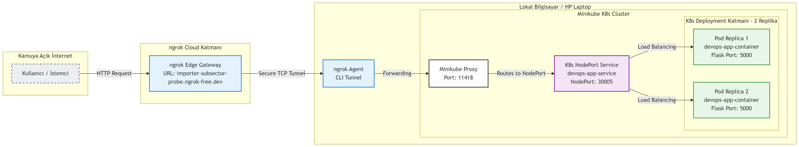

# DevOps Project — Micro HTTP Service & Containerization

Bu proje, Dockerize edilmiş, otomatik test süreçlerine (CI) sahip ve Kubernetes ortamında ölçeklenebilir şekilde tasarlanmış modern bir mikro HTTP servis altyapısı projesidir.

---

## Proje Yapısı

| Endpoint  | Açıklama |
|-----------|----------|
| `/ping`   | `pong` yanıtı dönen temel sağlık endpoint'i. |
| `/healthz` | Kubernetes Liveness/Readiness probe'ları için sağlık kontrolü endpoint'i. |

---

## Teknolojiler ve Karar Günlüğü

| Teknoloji | Neden Seçildi? |
|-----------|----------------|
| **Python & Flask** | Hafif, hızlı ayağa kalkan ve düşük kaynak tüketimli bir HTTP servisi için tercih edildi. |
| **Multi-Stage Docker Build** | İmaj boyutunu minimumda tutmak ve production ortamına yalnızca çalışan kodu taşımak için kullanıldı. |
| **Non-Root User (Güvenlik)** | Konteyner güvenliğini artırmak adına uygulama, `root` yerine sınırlı yetkiye sahip `appuser` (UID: 10001) olarak çalışmaktadır. |

---

## Yerelde Çalıştırma

### Docker ile Çalıştırma

**1. İmajı derleyin:**

```bash
docker build -t my-devops-app .
```

**2. Konteyneri ayağa kaldırın:**

```bash
docker run -p 5000:5000 my-devops-app
```

Uygulama ayağa kalktıktan sonra aşağıdaki adresten test edebilirsiniz:

```
http://localhost:5000/ping
```

---

## Endpoint Testi

```bash
# Temel ping kontrolü
curl http://localhost:5000/ping

# Sağlık durumu kontrolü
curl http://localhost:5000/healthz
```

---

## Güvenlik Notları

- Konteyner içinde `root` yetkisi **kullanılmamaktadır**.
- Uygulama kullanıcısı: `appuser` (UID: `10001`)
- Multi-stage build sayesinde build araçları ve geliştirme bağımlılıkları final imaja dahil **edilmemektedir**.

---

## Canlı Ortam Değerlendirmesi (Production Preview)

Proje, yerel Kubernetes (Minikube) cluster'ı üzerinde ayağa kaldırılmış ve güvenli bir tünel (ngrok) vasıtasıyla dış dünyaya/internete açık hale getirilmiştir.

* **Canlı API URL:** [https://importer-subsector-probe.ngrok-free.dev](https://importer-subsector-probe.ngrok-free.dev)
* **Canlı Ping Endpoint'i:** `https://importer-subsector-probe.ngrok-free.dev/ping`
* **Canlı Sağlık Kontrolü:** `https://importer-subsector-probe.ngrok-free.dev/healthz`

### Altyapı İstek Akış Mimarisi
`İstek (İnternet)` -> `ngrok Cloud` -> `Lokal ngrok Tüneli` -> `Minikube Proxy (Port: 11418)` -> `Kubernetes NodePort Service (Port: 30005)` -> `Pod (Flask App - Port: 5000)`

