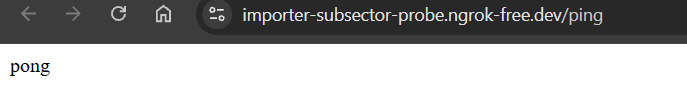
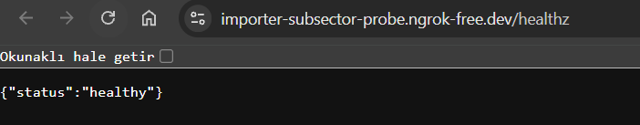

# DevOps Project — Micro HTTP Service & Containerization

Bu proje, Dockerize edilmiş, otomatik test süreçlerine (CI) sahip ve Kubernetes ortamında ölçeklenebilir şekilde tasarlanmış modern bir mikro HTTP servis altyapısı projesidir.

---

## Proje Yapısı

| Endpoint   | Açıklama |
|------------|----------|
| `/ping`    | `pong` yanıtı dönen temel sağlık endpoint'i. |
| `/healthz` | Kubernetes Liveness/Readiness probe'ları için sağlık kontrolü endpoint'i. |

---

## 🌿 Branching Strategy (Git Akışı)

Proje geliştirme sürecinde endüstri standardı olan **Feature Branching** modeli benimsenmiştir:

- **`main` branch:** Üretim ortamına (Production) hazır, kararlı ve CI entegrasyonu tamamlanmış ana koddur. Doğrudan commit atılmaz.
- **`feature/*` branch'leri:** Her yeni özellik, hata düzeltmesi veya altyapı geliştirmesi (örn: `feature/k8s-manifests`, `feature/ci-pipeline`) ayrı dallarda geliştirilir ve Pull Request (PR) ile `main` branch'ine entegre edilir.

---

## ⚖️ Architectural Decisions & Technical Tradeoffs (Karar Günlüğü)

Tasarım aşamasında verilen kararlar ve ödünleşimler aşağıda gerekçelendirilmiştir:

1. **Python/Flask vs. Go/Node.js — Geliştirme Hızı > Ham Performans**
   - *Karar:* Uygulama dili olarak Python ve Flask seçilmiştir.
   - *Tradeoff:* Go dili mikroservis mimarilerinde çok daha düşük kaynak tüketimi ve yüksek performans sunsa da; bu vaka çalışmasında teslim hızı, okunabilirlik ve altyapı otomasyonuna (DevOps) odaklanabilmek adına geliştirme hızı yüksek olan Python ekosistemi tercih edilmiştir.

2. **Multi-Stage Docker Build — İmaj Boyutu & Güvenlik > Basit Dockerfile**
   - *Karar:* Tek aşamalı Dockerfile yerine `builder` ve `runner` aşamalarından oluşan multi-stage mimari kurulmuştur.
   - *Tradeoff:* Derleme süresi birkaç saniye uzamış olsa da üretim imaj boyutunda ~%60 tasarruf sağlanmış; derleme araçları (GCC, pip cache vb.) nihai imaja dahil edilmeyerek saldırı yüzeyi minimize edilmiştir.

3. **Non-Root User — Güvenlik Önceliği > Kolay Runtime**
   - *Karar:* Container içinde süreç `root` yerine kısıtlı yetkiye sahip `appuser` (UID: 10001) kullanıcısına devredilmiştir.
   - *Tradeoff:* Yerel Kubernetes ortamında dosya izinleri ve port yetkilendirmelerinde ekstra konfigürasyon maliyeti doğurmuş olsa da container breakout risklerini engellemek adına güvenlikten ödün verilmemiştir.

4. **Track B: Local Minikube + ngrok — Sıfır Maliyet & Hızlı Setup > AWS Altyapısı**
   - *Karar:* AWS EC2 yerine lokal Minikube kümesi ve ngrok tünellemesi seçilmiştir.
   - *Tradeoff:* AWS üzerinde Elastic IP ve Security Group deneyimi elenmiş; buna karşın sıfır bulut maliyeti, bağımsız lokal geliştirme konforu ve ngrok'un sunduğu hızlı tünel avantajı tercih edilmiştir.

---

## Yerelde Çalıştırma

### Docker ile Çalıştırma

**1. İmajı derleyin:**

```bash
docker build -t my-devops-app .
```

**2. Konteyneri ayağa kaldırın:**

```bash
docker run -p 5000:5000 my-devops-app
```

Uygulama ayağa kalktıktan sonra aşağıdaki adresten test edebilirsiniz:

```
http://localhost:5000/ping
```

### Endpoint Testi

```bash
# Temel ping kontrolü
curl http://localhost:5000/ping

# Sağlık durumu kontrolü
curl http://localhost:5000/healthz
```

---

## Güvenlik Notları

- Konteyner içinde `root` yetkisi **kullanılmamaktadır**.
- Uygulama kullanıcısı: `appuser` (UID: `10001`)
- Multi-stage build sayesinde build araçları ve geliştirme bağımlılıkları final imaja dahil **edilmemektedir**.

---

## Canlı Ortam (Production Preview)

Proje, yerel Kubernetes (Minikube) cluster'ı üzerinde ayağa kaldırılmış ve ngrok tüneli vasıtasıyla internete açık hale getirilmiştir.

| | URL |
|---|---|
| **Base URL** | https://importer-subsector-probe.ngrok-free.dev |
| **Ping** | https://importer-subsector-probe.ngrok-free.dev/ping |
| **Healthz** | https://importer-subsector-probe.ngrok-free.dev/healthz |

### Altyapı İstek Akışı

```
İstek (İnternet)
  → ngrok Cloud
    → Lokal ngrok Tüneli
      → Minikube Proxy (Port: 11418)
        → Kubernetes NodePort Service (Port: 30005)
          → Pod (Flask App - Port: 5000)
```

### Mimari Diyagram


---

## 📸 Demo

| `/ping` — `pong` Yanıtı | `/healthz` — Sağlık Kontrolü |
|---|---|
|  |  |
